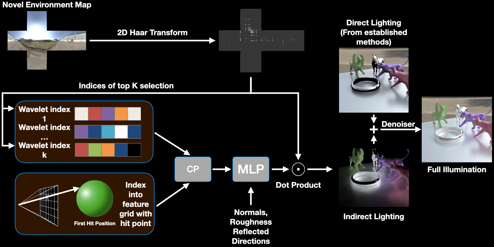

# Neural Free-Viewpoint Relighting for Glossy Indirect Illumination Real Time Demo

<div style="text-align: center;">
  [<a href="https://arxiv.org/abs/2307.06335">Paper Link</a>]
</div>

### Quick summary of the paper
We developed a neural representation for indirect illumination in synthetic scenes using wavelets. This allows the renderer to query the neural representation directly, bypassing the need for expensive path tracing to compute indirect lighting.

We also provide a dedicated visualization tool where you can compare our wavelet-based rendering with standard ray tracing and traditional Spherical Harmonics-based Precomputed Radiance Transfer (PRT) across our test scenes.

## Overview
This engine is designed to include all necessary source files required for operation. It primarily supports Windows but is compatible with Linux systems as well.

## Dependencies
Ensure the following dependencies are installed and properly configured. Other Cuda or Optix versions might work, but they have not been tested.
- Git Submodules (included in this repo)
- glfw3 `sudo apt-get install libglfw3-dev`
- CUDA 12.4 (Anything lower will not work)
- Optix 7.6

## Building 
### Configuring CMake
This project is built using Cmake. During CMake configuration, set the `OptiX_ROOT_DIR` to point to the root folder of your Optix installation.
```bash
mkdir build
cd  build
cmake -DOptiX_ROOT_DIR=/path/to/your/optix ..
```

### Windows
Double click `nertRenderer.sln` in your build folder and it will launch VS 2022. Click `Build/Build Solution` in the menu bar. The build will take couple minutes and you will find the executable in `\bin\Debug\PathTracer.exe`

### Linux
Run `make` in your build folder and you will find the executable in `\bin\Debug\PathTracer`

## Getting Started

### Downloading Data
The data required for running the engine can be downloaded from [this link](https://drive.google.com/file/d/1kF7lhj779b6B20xxYruloe74wIXiGcdr/view?usp=sharing).

### Running the Program
Note that the program will silently fail on the first run (due to shader compilation) but should operate normally on subsequent attempts.

### Viewing a Scene
To view a scene, use the `-m` flag to specify a directory or a cube map environment map. Follow the format specified in the accompanying ZIP file for directories. The engine loads all environment maps in the specified folder, allowing you to switch between them interactively unless the `-n specific_name` flag is set.

Normally, you should use environment maps in `EnvmapStatic` with `-n` flag and `EnvmapRotation` without.

**Examples:**
```bash
PathTracer -v -m nert_public\EnvmapStatic -n 2169_120 nert_public\scenes\kitchen\scene.pbrt

PathTracer -v -m nert_public\EnvmapRotation\2124 nert_public\scenes\kitchen\scene.pbrt
```
### Testing Wavelet PRT (Ours) in an Interactive Window
**Examples:**
```bash
PathTracer -v -m nert_public\EnvmapStatic -n 2169_120 -w nert_public\Weights\rnith-kitchen-final nert_public\scenes\kitchen\scene.pbrt 

PathTracer -v -m nert_public\EnvmapStatic -n 2169_120 -w nert_public\Weights\rnith-armadillo-final nert_public\scenes\armadillo\scene.pbrt 

PathTracer -v -m nert_public\EnvmapStatic -n 2169_120 -w nert_public\Weights\rnith-fouranimals-final nert_public\scenes\four_animals_cook\scene.pbrt 

PathTracer -v -m nert_public\EnvmapRotation\2148 -w nert_public\Weights\rnith-kitchen-final nert_public\scenes\kitchen\scene.pbrt 
```
To switch between our technique and traditional rendering, press `l`.

### Rendering with Indirect Spherical Harmonics (SH)
Note: Only scene `four_animals_cook` supports SH and environment map `2169` supports rotation environment maps.

**Examples:**
```
PathTracer -v -m nert_public\EnvmapStatic -n 2124_120 -k nert_public\Weights\fouranimals-final-Tmatrix\t_matrix.npy nert_public\scenes\four_animals_cook\scene.pbrt

PathTracer -v -m nert_public\EnvmapRotation\2169 -k nert_public\Weights\fouranimals-final-Tmatrix\t_matrix.npy nert_public\scenes\four_animals_cook\scene.pbrt
```
### To render out a Eval or Image or PSNR trajectory
Our render engine supports offline rendering for both path tracing results and our neural wavelet approach. This process requires a trajectory file, which is used to calculate PSNR values as detailed in our research.

#### Usage Guidelines:

- If the trajectory file's name includes the name of an environment map, you must use corresponding maps from the EnvmapRotation directory.
- Specify the necessary flags and file paths according to the command structure below.
- You don't have to supply the `-w` flag if you don't want to see the wavelet rendering results.

**Examples:**
```
PathTracer -t nert_public\Trajectories\PSNR\kitchen_eval_psnr.txt -m nert_public\EnvmapStatic -w nert_public\Weights\rnith-kitchen-final nert_public\scenes\kitchen\scene.pbrt temp

PathTracer -t nert_public\Trajectories\Eval\kitchen_eval_eight_2148.txt -m nert_public\EnvmapRotation\2148 -w nert_public\Weights\rnith-kitchen-final nert_public\scenes\kitchen\scene.pbrt temp
```
Additionally, the engine supports rendering of Spherical Harmonics (SH) within trajectories:
```
PathTracer -t nert\nert_public\Trajectories\Eval\fourAnimals_eval_helix_1_2169.txt -m nert_public\EnvmapRotation\2169 -k nert_public\Weights\fouranimals-final-Tmatrix\t_matrix.npy nert_public\scenes\four_animals_cook\scene.pbrt temp
```
### To generate the T matrix for any scene
Generate T matrices for any scene with up to degree 8 spherical harmonics. We store the harmonics on vertices so the number of vertices significantly affects the T matrix size and rendering time.
```
PathTracer -m nert_public\ShTmatrixEnvmaps -p 8 nert_public\scenes\four_animals_cook\scene.pbrt temp\t_matrix_full.npy
```
